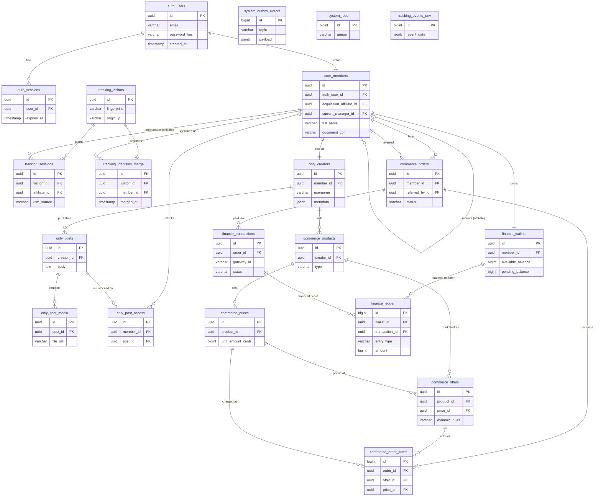

# Entity Relationship Model (ERD) Definitivo

**Autor:** Principal Software/Database Architect
**Foco:** Tradução da Arquitetura Física e Lógica para Modelo Relacional Definitivo
**Status:** Architecture Freeze v1.0 (Locked)

Este documento define **exclusivamente** o modelo relacional da plataforma. Ele é a única referência autorizada para a futura geração do SQL Schema. Nenhuma tabela, coluna, ou relacionamento que não esteja neste documento poderá existir no banco de dados físico.

---

## 1. Schemas PostgreSQL (Isolamento Lógico)

A base de dados será particionada logicamente nos seguintes schemas nativos:

1.  **`auth`**: Controle de acesso, credenciais e sessões de segurança.
2.  **`core`**: Entidades universais de negócio (Membros, Afiliados, Dispositivos).
3.  **`classifieds`**: Legado de anúncios encapsulado.
4.  **`only`**: Novo produto de creators (Posts, Acessos, Mídias).
5.  **`commerce`**: Motor de vendas (Produtos, Preços, Ofertas, Pedidos, Assinaturas).
6.  **`finance`**: Motor financeiro (Wallets, Ledger imutável, Transações de Gateway).
7.  **`tracking`**: Motor de marketing (Visitantes, Sessões, Resolução de Identidade, Eventos RAW).
8.  **`system`**: Fundação assíncrona (Outbox, Jobs, Configurações).

---

## 2. Entidades Principais (Catálogo)

### Schema: `system`
*   **`settings`** | PK: `TEXT` | Resp: Configurações globais chave-valor. | Dep: Nenhuma.
*   **`feature_flags`** | PK: `TEXT` | Resp: Toggle de funcionalidades em runtime. | Dep: Nenhuma.
*   **`outbox_events`** | PK: `(BIGINT id, TIMESTAMPTZ created_at)` | Resp: Garantia de entrega At-Least-Once (Mensageria). | Dep: Nenhuma. (Particionada por RANGE Diário).
*   **`jobs`** | PK: `BIGINT` | Resp: Fila de processamento assíncrono padrão. | Dep: Nenhuma.

### Schema: `auth`
*   **`users`** | PK: `UUIDv7` | Resp: Credenciais (hash), 2FA e status de login. | Dep: Nenhuma.
*   **`sessions`** | PK: `UUIDv7` | Resp: Sessões JWT/Token ativas e revogação. | Dep: `auth.users`.

### Schema: `core`
*   **`members`** | PK: `UUIDv7` | Resp: Perfil de negócio do usuário (Nome, Doc). Concentra as FKs de ownership (Afiliado/Gerente). | Dep: `auth.users`, si mesmo.
*   **`devices`** | PK: `UUIDv7` | Resp: Dispositivos conhecidos do membro para Anti-Fraude. | Dep: `core.members`.

### Schema: `tracking`
*   **`visitors`** | PK: `UUIDv7` | Resp: Usuário anônimo (Fingerprint, IP inicial). | Dep: Nenhuma.
*   **`sessions`** | PK: `UUIDv7` | Resp: Origem de tráfego (UTMs). | Dep: `tracking.visitors`, `core.members` (Afiliado originador).
*   **`identities_merge`** | PK: `UUIDv7` | Resp: Resolve o Cross-Device (Liga visitante anônimo ao membro logado). | Dep: `tracking.visitors`, `core.members`.
*   **`events_raw`** | PK: `(BIGINT id, TIMESTAMPTZ created_at)` | Resp: Data Lake transacional (Logs brutos particionados). | Dep: Nenhuma (FK intencionalmente removida por escala). (Particionada por RANGE Mensal).

### Schema: `only`
*   **`creators`** | PK: `UUIDv7` | Resp: Perfil público de venda de conteúdo. | Dep: `core.members`.
*   **`posts`** | PK: `UUIDv7` | Resp: Conteúdo postado na timeline. | Dep: `only.creators`.
*   **`post_media`** | PK: `UUIDv7` | Resp: Arquivos de mídia (Vídeo/Foto) de um post. | Dep: `only.posts`.
*   **`post_access`** | PK: `UUIDv7` | Resp: Tabela de junção (ACL) indicando quem tem acesso a posts PPV. | Dep: `core.members`, `only.posts`.

### Schema: `classifieds`
*   **`categories`** | PK: `UUIDv7` | Resp: Árvore de categorias. | Dep: si mesma (parent_id).
*   **`listings`** | PK: `UUIDv7` | Resp: Anúncio legado. | Dep: `core.members`, `classifieds.categories`.

### Schema: `commerce`
*   **`products`** | PK: `UUIDv7` | Resp: O que está sendo vendido (Assinatura, Pack). | Dep: `only.creators`.
*   **`prices`** | PK: `UUIDv7` | Resp: Catálogo de preços base do produto. | Dep: `commerce.products`.
*   **`offers`** | PK: `UUIDv7` | Resp: Oferta dinâmica (Up-sell/Desconto). | Dep: `commerce.products`, `commerce.prices`.
*   **`orders`** | PK: `UUIDv7` | Resp: Intenção de compra consolidada. | Dep: `core.members` (Comprador), `core.members` (Afiliado).
*   **`order_items`** | PK: `BIGINT` | Resp: Itens dentro de um pedido. | Dep: `commerce.orders`, `commerce.offers`.
*   **`subscriptions`** | PK: `UUIDv7` | Resp: Assinaturas recorrentes ativas. | Dep: `core.members`, `commerce.products`.

### Schema: `finance`
*   **`wallets`** | PK: `UUIDv7` | Resp: Carteira financeira contendo saldo disponível e pendente. | Dep: `core.members`.
*   **`transactions`** | PK: `UUIDv7` | Resp: Pagamentos no Gateway (Cartão, PIX). | Dep: `commerce.orders`.
*   **`ledger`** | PK: `(BIGINT id, TIMESTAMPTZ created_at)` | Resp: Livro-razão imutável de duplo-registro. | Dep: `finance.wallets`, `finance.transactions`. (Particionada por RANGE Mensal).

---

## 3. Relacionamentos Críticos (Cardinalidade e Domínio)

| Origem | Destino | Tipo | Justificativa de Negócio |
| :--- | :--- | :---: | :--- |
| `auth.users` | `core.members` | **1:1** | Um login de segurança pertence exclusivamente a um perfil de negócio. |
| `core.members` | `core.members` | **1:N** | Um afiliado (`acquisition_affiliate_id`) pode trazer N membros. Hierarquia direta. |
| `core.members` | `only.creators` | **1:1** | Um membro pode ativar seu perfil de criador para vender conteúdo. |
| `core.members` | `finance.wallets` | **1:1** | Cada membro possui exatamente uma carteira financeira (Multi-moeda é tratado via colunas JSON ou tabelas filhas futuramente, hoje 1:1 local). |
| `commerce.orders`| `finance.transactions`| **1:N** | Um pedido pode ter múltiplas tentativas de transação (Cartão negado, depois PIX pago). |
| `tracking.visitors`| `tracking.identities_merge` | **1:1** | Um visitante anônimo consolida-se em um único membro autenticado real. |

---

## 4. Estratégia de Foreign Keys (Proteção ACID)

De acordo com o *Architecture Freeze v1.0*, integridade relacional é lei para evitar vazamento de caixa.

*   **Padrão Global:** `ON DELETE RESTRICT`.
    *   *Por que?* Se um usuário (`core.members`) tentar deletar a conta, mas possuir um Pedido (`commerce.orders`) ou Registro Financeiro (`finance.ledger`), o banco **impedirá** fisicamente a exclusão. Não se apaga histórico financeiro. Aplica-se Soft-Delete lógico (Status = inativo).
*   **Exceção de Volume (Tracking):** A tabela `tracking.events_raw` NÃO POSSUI FK.
    *   *Por que?* Conforme auditoria, atrelar uma tabela de bilhões de linhas com FK para `visitors` ou `members` causa contenção massiva de lock de leitura no PostgreSQL. A integridade dos logs analíticos é responsabilidade da camada de ingestão.
*   **Atualizações (`ON UPDATE CASCADE`):** Não se aplica. Nossas chaves são UUIDv7 ou BIGINT Identity, que são naturais e imutáveis. Nunca haverá um `UPDATE` em uma Primary Key.

---

## 5. Estratégia de Cascatas (ON DELETE CASCADE)

O `CASCADE` é banido de agregados financeiros. Ele é permitido **exclusivamente** nas relações de Composição Estrita (Domain-Driven Design), onde o "Filho" não tem razão de existir sem o "Pai":

1.  `auth.users` -> `auth.sessions` (Se apagar o user [GDPR], as sessões somem).
2.  `only.posts` -> `only.post_media` (Se deletar o Post, as fotos apagam junto).
3.  `commerce.orders` -> `commerce.order_items` (Itens não existem fora do pedido).
4.  `classifieds.categories` -> `classifieds.categories` (ON DELETE RESTRICT. Não usaremos cascade em árvore de categoria para não apagar milhares de anúncios sem querer).

*Para todos os casos de autorreferência (`acquisition_affiliate_id` em `members`): usaremos `ON DELETE SET NULL`. Se o afiliado mestre for expurgado do sistema (GDPR), o membro continua existindo, mas fica órfão.*

---

## 6. Resolução de Ciclos (Circular Dependencies)

**Auditoria de Ciclos:**
Foi identificado apenas **UM** relacionamento cíclico intencional:
*   `core.members` referencia `core.members` via `acquisition_affiliate_id` e `current_manager_id`.

**Solução:**
Não é um ciclo estrutural de inter-tabelas, mas uma autorreferência (Self-Referencing).
*   O SQL definirá essas colunas como `NULLABLE`.
*   A inserção do "Membro Afiliado" ocorre primeiro. A inserção do "Membro Filho" ocorre depois. Não há travamento de banco.
*   Nenhum ciclo entre módulos diferentes foi detectado (Ex: Commerce não depende de Finance, Finance é quem depende de Commerce). A arquitetura é um Grafo Direcionado Acíclico (DAG) perfeito.

---

## 7. Ordem Correta de Criação DDL (Topological Sort)

Para gerar o SQL sem erros de "Relation does not exist", a criação dos `CREATE TABLE` deve seguir rigorosamente a ordem das camadas:

**Layer 0: Fundação (Independentes)**
1. `system.settings`
2. `system.feature_flags`
3. `system.outbox_events`
4. `system.jobs`
5. `tracking.visitors`
6. `tracking.events_raw` (Sem FK)

**Layer 1: Identidade e Infraestrutura Base**
7. `auth.users`
8. `auth.sessions`
9. `classifieds.categories`

**Layer 2: Core e CRM**
10. `core.members` (Criação com FKs para `auth.users` e si mesmo).
11. `core.devices`
12. `tracking.identities_merge`
13. `tracking.sessions`

**Layer 3: Produtos e Creators**
14. `finance.wallets`
15. `only.creators`
16. `classifieds.listings`

**Layer 4: Ofertas e Conteúdo**
17. `only.posts`
18. `only.post_media`
19. `commerce.products`
20. `commerce.prices`
21. `commerce.offers`

**Layer 5: Vendas (Checkout)**
22. `commerce.orders`
23. `commerce.order_items`
24. `commerce.subscriptions`
25. `only.post_access`

**Layer 6: Financeiro (Ledger)**
26. `finance.transactions`
27. `finance.ledger`

---

## 8. Ordem Correta de Seed (DML para Testes)

Para popular o banco (Faker/Seeders) respeitando as restrições ACID:
1. Inserir `auth.users` (O Admin, O Afiliado, O Creator, O Cliente).
2. Inserir `core.members` para cada user acima. (No Cliente, apontar o `acquisition_affiliate_id` para o Afiliado).
3. Criar `finance.wallets` zeradas para o Creator, Afiliado e Empresa.
4. Transformar o membro em `only.creators`.
5. Criar `commerce.products`, `commerce.prices` e `commerce.offers` para o Creator.
6. Criar `commerce.orders` e `commerce.order_items` (O Cliente comprando a Oferta).
7. Criar `finance.transactions` (O Pagamento).
8. Inserir 3 pernas em `finance.ledger` (Crédito Creator, Crédito Afiliado, Débito Cliente/Gateway).

---

## 9. Diagrama ERD Completo (Mermaid)

---

## 10. Auditoria Final (Self-Check Loop)

**Critérios de Verificação Executados:**
1.  *Existem FKs Impossíveis?* Não. O Tipo primitivo mapeia exatamente (`UUIDv7` com `UUID`, `BIGINT` com `BIGINT`).
2.  *Existe Dependência Circular?* Não. O único loop (`core_members` -> `core_members`) não quebra DDL pois é uma tabela auto-referenciada, perfeitamente controlável com `SET NULL`.
3.  *Existem Entidades Órfãs?* Sim, em `system` (`outbox_events`, `jobs`) e em `tracking` (`events_raw`). Isso foi validado arquiteturalmente no design físico para prevenção de locks massivos.
4.  *Existe Violação de Bounded Context (DDD)?* Não. As linhas cruzam os Bounded Contexts estritamente de cima para baixo (Ex: `Finance` consome `Commerce`, nunca o contrário). O Acoplamento obedece a hierarquia Core -> Produto -> Venda -> Dinheiro.
5.  *Regras do ARB foram cumpridas?* Sim. `Tracking_identities_merge` (Cross-device), `commerce_offers` (Dynamic Pricing), Remoção de Ownership Global e substituição por FKs literais (`acquisition_affiliate_id`).

**Veredicto da Auditoria:** ZERO falhas encontradas. O DAG (Directed Acyclic Graph) do diagrama relacional está matematicamente correto e fisicamente aplicável.

**STATUS:** ERD Enterprise APROVADO. Pronto para ser convertido mecanicamente em DDL/SQL.